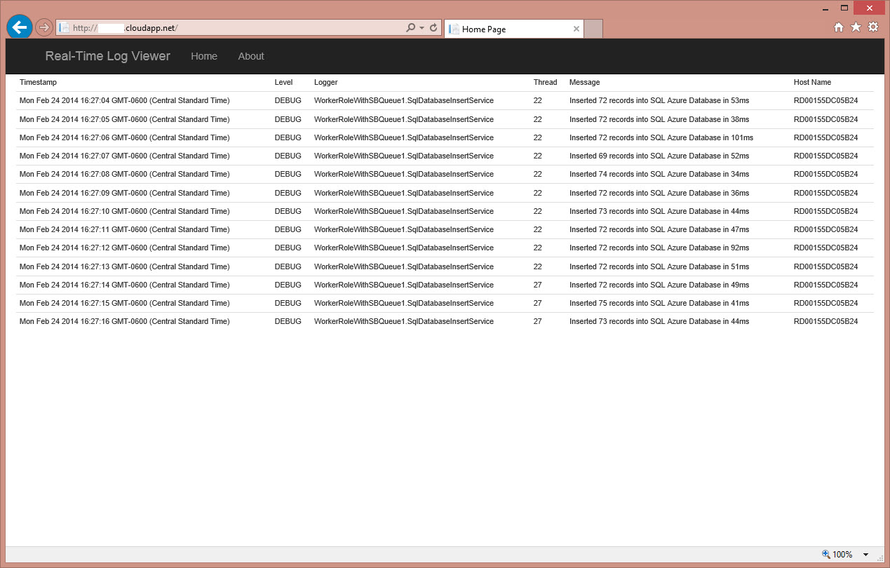

# LogHub

The easiest way to view real-time log messages from distributed applications.

Use UDP appenders in log4net to send your real-time messages to a central location. No data is ever stored. You'll see a live streaming SignalR view within your browser containing messages from all of the various services within your application.

## Getting Started

1. Get the code
2. Deploy to an Azure Web Role
3. Browse to the "About" page on the deployed site for the appender code 

# License

Microsoft Developer & Platform Evangelism

Copyright (c) Microsoft Corporation. All rights reserved.

THIS CODE AND INFORMATION ARE PROVIDED "AS IS" WITHOUT WARRANTY OF ANY KIND, EITHER EXPRESSED OR IMPLIED, INCLUDING BUT NOT LIMITED TO THE IMPLIED WARRANTIES OF MERCHANTABILITY AND/OR FITNESS FOR A PARTICULAR PURPOSE.

The example companies, organizations, products, domain names, e-mail addresses, logos, people, places, and events depicted herein are fictitious. No association with any real company, organization, product, domain name, email address, logo, person, places, or events is intended or should be inferred.

